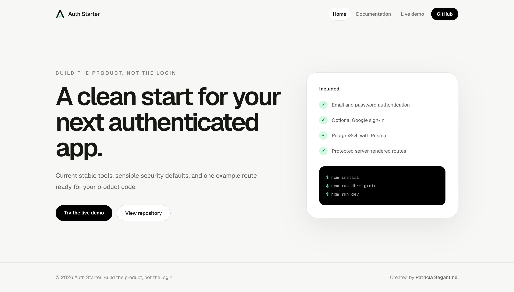

# Auth Starter Site

The public website and documentation for Auth Starter, a reusable
authentication foundation for Next.js applications.



## Why this project exists

I am always creating small products and experimenting with new ideas. The
product changes, but the first development steps are often the same:
authentication, sessions, database configuration, protected routes, social
login, and password recovery.

Rebuilding that foundation for every project takes time away from the product
itself. Auth Starter is an effort to make that setup reusable, consistent, and
faster, so new applications can begin with a solid foundation instead of an
empty project.

## Current status

This repository contains only the public landing page and documentation for
Auth Starter. Authentication, database, email, and protected-route code belong
in the separate template repository.

Available now:

- Responsive landing page
- Project overview
- Public documentation
- Adaptive branding and favicon
- Direct access to the template repository and hosted live demo

Planned for later iterations:

- Architecture and implementation guides
- Command-line installer

## Repositories

The project is split into two repositories with separate responsibilities:

| Repository | Responsibility |
| --- | --- |
| [nextjs-auth-starter-site](https://github.com/patriciasegantine/nextjs-auth-starter-site) | Public landing page and documentation |
| [nextjs-auth-starter-template](https://github.com/patriciasegantine/nextjs-auth-starter-template) | Authentication implementation and reusable application template |

Keeping them separate ensures that applications created from the template do
not inherit marketing pages or documentation-specific code.

Try the authentication flow in the
[hosted live demo](https://ps-nextjs-auth-starter-demo.vercel.app).

## Run locally

```bash
git clone git@github.com:patriciasegantine/nextjs-auth-starter-site.git
cd nextjs-auth-starter-site
npm install
npm run dev
```

Open [http://localhost:3000](http://localhost:3000).

## Stack

- Next.js 16
- React 19
- TypeScript
- Tailwind CSS 4

## Future CLI

After the template has been validated in real projects, a possible evolution
is a command-line installer for creating a configured application:

```bash
npx create-nextjs-auth-starter my-app
```

This command is part of the project roadmap and is not available yet.

## License

MIT

---

## Author

Created by **Patricia Segantine**, Senior Frontend Engineer

[LinkedIn](https://linkedin.com/in/patriciasegantine) · [Portfolio](https://patriciasegantine.vercel.app/)
